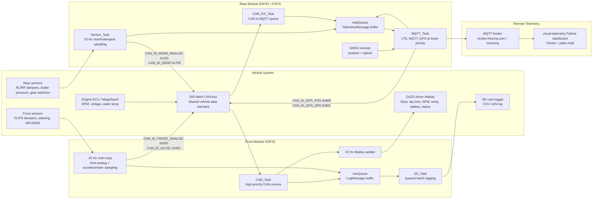

# Telemetry 2026 Software Architecture

## Purpose

The telemetry software provides vehicle observability for the Formula Student car. It collects local front and rear sensor data, receives engine data from the CAN bus, records telemetry to an SD card, publishes selected telemetry over MQTT, and displays critical driver information on the front OLED.

The current telemetry system is not designed to directly actuate safety-critical functions. Critical control remains isolated in the vehicle ECU and other dedicated vehicle systems. The telemetry modules are designed to be robust observers and gateways: failures in logging, display, GPS, or cloud upload should not block sensor acquisition or CAN reception.

## High-Level Architecture



## Main Software Modules

### Front-Module firmware

Location: `Front-Module/`

- `src/main.cpp`: initializes the front module and runs the 20 Hz main sampling loop.
- `src/setup.cpp`: initializes GPIO, SD card, OLED display, MPU6050 IMU, and ESP32 TWAI CAN.
- `src/loop.cpp`: implements CAN transmission, CAN reception, SD logging, and display update logic.
- `include/canIDs.h`: defines the shared CAN message identifiers used by both front and rear modules.
- `include/pinout.h`: defines the hardware interface pins for sensors, SD, OLED, IMU, and CAN.

Responsibilities:

- Samples front damper and steering analog channels at 20 Hz.
- Samples MPU6050 acceleration data and broadcasts it on CAN.
- Receives all CAN traffic and logs it through a FreeRTOS queue.
- Updates the driver-facing OLED display at 10 Hz.
- Stores CAN telemetry to an SD card in CSV format with session-based filenames.

### Rear-Module firmware

Location: `Rear-Module/`

- `src/main.cpp`: initializes queues, hardware, modem, MQTT, CAN, and FreeRTOS tasks.
- `src/setup.cpp`: initializes GPIO, LTE modem, MQTT client, GNSS, and ESP32 TWAI CAN.
- `src/loop.cpp`: implements rear sensor sampling, gear reading, GPS parsing, CAN receive, and MQTT upload.
- `include/canIDs.h`: mirrors the shared CAN message identifiers.
- `include/pinout.h`: defines modem, CAN, analog sensor, and gear input pins.

Responsibilities:

- Samples rear dampers, brake pressure, and gear switches at 20 Hz.
- Receives CAN traffic from the rest of the vehicle.
- Publishes telemetry to MQTT using LTE.
- Reads GNSS position/speed at a lower rate so GPS/modem latency does not block sensor sampling.
- Re-broadcasts GPS data onto CAN for local logging and display consumers.

### Visual telemetry dashboard

Location: `visual-telemetry/`

- `main.py`: Tkinter dashboard that subscribes to the MQTT topic, decodes CAN-style payloads, and displays live vehicle data.

Responsibilities:

- Connects to `broker.hivemq.com` on topic `tuiracing`.
- Parses messages in `timestamp,id,data` format.
- Decodes known CAN IDs into engineering values for RPM, gear, temperatures, battery voltage, damper positions, brake pressure, acceleration, GPS position, and speed.
- Highlights stale data for selected critical values.

## Interfaces

### CAN bus

The CAN bus is the primary in-vehicle telemetry interface. Both ESP32 modules use the native TWAI driver at 500 kbit/s.

| CAN ID | Source | Data |
| --- | --- | --- |
| `0x500` | Front module | Front damper 1, front damper 2, steering |
| `0x501` | Front module | Accelerometer X/Y/Z |
| `0x502` | Reserved/front module | Gyroscope X/Y/Z |
| `0x600` | Engine ECU | RPM |
| `0x601` | Engine ECU | Battery voltage |
| `0x602` | Engine ECU | Water temperature |
| `0x700` | Rear module | Gear |
| `0x701` | Rear module | Rear left damper, rear right damper, brake pressure |
| `0x800` | Rear module | GPS latitude and longitude |
| `0x801` | Rear module | GPS speed |
| `0x900` | Reserved | Lap time |

### MQTT telemetry

The rear module publishes telemetry using the same payload format used by the SD logger:

```text
timestamp,id,data
```

Example:

```text
123456,701,03FF0400012C
```

This format keeps cloud telemetry aligned with CAN and SD logging, making debug traces easier to compare.

### SD logging

The front module logs CAN messages to session-specific CSV files on the SD card. The log includes timestamp, CAN ID, and raw data bytes encoded as hexadecimal. Batching and periodic flushes are used to reduce SD write overhead while still preserving data during idle periods.

## Robustness And Functional Safety Approach

### Separation of concerns

The architecture separates time-sensitive vehicle data handling from slower or failure-prone peripherals:

- Sensor sampling and CAN reception are independent FreeRTOS tasks or timed loops.
- SD card writes are handled through `canQueue` instead of being performed directly in the CAN receive path.
- MQTT, LTE, and GPS processing run in a lower-priority rear-module task.
- Driver display updates run at 10 Hz instead of blocking the 20 Hz acquisition loop.

This prevents slow storage, display, network, or GPS operations from directly blocking the acquisition of vehicle state data.

### Deterministic timing

The front module uses a 20 Hz loop period for front analog/IMU sampling and a separate 10 Hz display period. The rear module uses a 20 Hz `Sensor_Task` with `vTaskDelayUntil`, while GPS and MQTT are processed in a lower-priority task. This creates predictable acquisition timing for chassis and brake telemetry.

### Queue-based buffering

Both modules use bounded FreeRTOS queues:

- `canQueue` buffers messages for SD logging on the front module.
- `mqttQueue` buffers local and received CAN messages for MQTT upload on the rear module.

This reduces coupling between producers and consumers. If a consumer is temporarily slow, the sampling and CAN receive tasks can continue until the queue limit is reached.

### Failure containment

The system is designed to continue operating with partial functionality:

- If the modem or network is unavailable, local CAN and sensor functionality continue.
- If MQTT is disconnected, the rear module retries without stopping the sensor task.
- If the SD card fails to initialize, the front module still initializes display, IMU, and CAN.
- If GNSS has no valid fix, invalid GPS frames are not broadcast.
- Display status flags can indicate missing rear, Wi-Fi, or ECU data.

### Traceability and diagnostics

The SD logger records raw CAN traffic in timestamped CSV form, making it possible to reconstruct vehicle data after a run. The visual dashboard also reports packet counts and marks stale data, helping the team detect missing or delayed telemetry during testing.

### Current safety boundary

The telemetry project currently observes and distributes state; it does not directly actuate throttle, brakes, steering, or shutdown controls. Safety-critical control functions should therefore remain implemented in dedicated ECU/safety hardware with their own validation, plausibility checks, and fail-safe outputs. Telemetry data can support diagnostics and driver awareness, but it should not be the sole source of a safety decision unless additional safety mechanisms are added and validated.

## Suggested Answer For Documentation

Our approach to software functional safety and robustness is based on separating safety-critical control from telemetry and then ensuring the telemetry software cannot block or destabilize vehicle state acquisition. The telemetry architecture is distributed across two ESP32-based modules connected to the vehicle CAN bus. The front module samples front chassis sensors and the IMU, receives all CAN traffic, logs it to an SD card, and updates the driver OLED. The rear module samples rear suspension, brake pressure, gear position, GPS, and bridges CAN telemetry to an MQTT link for remote visualization. Engine information such as RPM, voltage, and water temperature is received from the ECU over CAN.

Time-critical functions are isolated from slow peripherals using FreeRTOS tasks, fixed-rate loops, and message queues. Sensor acquisition runs at 20 Hz, CAN reception is handled in dedicated high-priority tasks, and slower operations such as SD writes, LTE/MQTT upload, GPS parsing, and OLED updates are decoupled. The front module logs through a `canQueue`, while the rear module uses an `mqttQueue`, so temporary delays in storage or communications do not immediately block CAN reception or sensor sampling.

The software also supports graceful degradation. If the LTE modem, MQTT broker, GPS fix, or SD card is unavailable, the remaining local telemetry functions continue. Raw CAN data is stored or transmitted in a consistent `timestamp,id,data` format, which improves traceability and allows post-run verification. The driver display shows the most relevant vehicle state values and can indicate missing subsystems.

At the current stage, telemetry is treated as an observer and diagnostics layer rather than an actuator for safety-critical control. The ECU and dedicated vehicle safety systems retain authority over critical control functions. This boundary reduces risk: a telemetry failure should affect visibility or logging, not core vehicle control. Future safety improvements should add explicit signal plausibility checks, stale-data timeouts for all critical channels, CAN message filtering, queue overflow counters, watchdog reporting, and documented test cases for startup failure, communication loss, and sensor fault scenarios.
